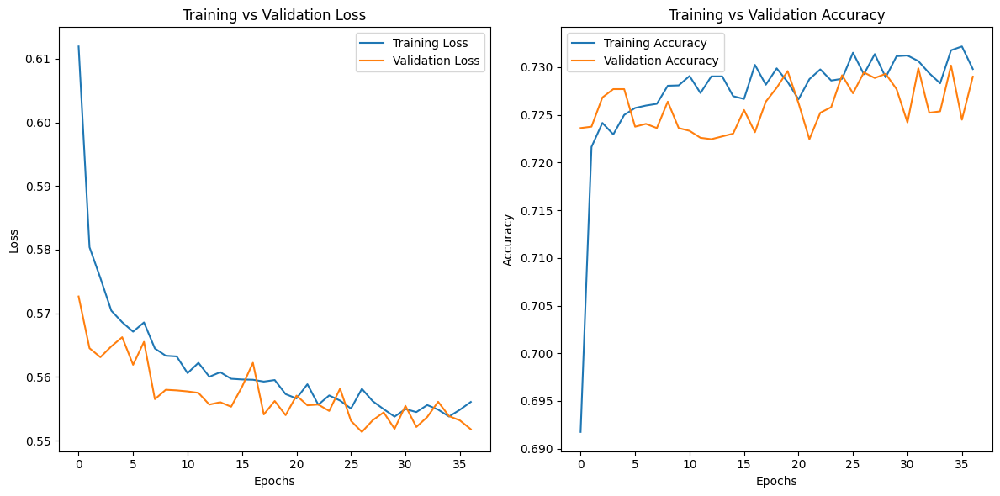

# Nonprofit Funding Success Prediction Using Deep Learning

## Overview

This project applies deep learning techniques to predict the success of charitable organizations in securing funding. A binary classification model was developed using **TensorFlow** and **Keras**, with the target variable `IS_SUCCESSFUL` indicating funding outcome (`1` = successful, `0` = not successful).

Despite iterative tuning—including dropout, early stopping, and optimizer changes—the model achieved a peak accuracy of **72.96%** and a loss of **0.55**, slightly below the target benchmark of 75%.

---

## Dataset and Preprocessing

The dataset `charity_data.csv` contains records of nonprofit organization applications, including financial and categorical metadata.

### Example Entry:

| EIN       | NAME                          | APPLICATION_TYPE | AFFILIATION | CLASSIFICATION | USE_CASE    | ORGANIZATION | STATUS | INCOME_AMT | SPECIAL_CONSIDERATIONS | ASK_AMT | IS_SUCCESSFUL |
|-----------|-------------------------------|------------------|-------------|----------------|-------------|--------------|--------|------------|------------------------|---------|----------------|
| 10520599  | BLUE KNIGHTS MOTORCYCLE CLUB  | T10              | Independent | C1000          | ProductDev  | Association  | 1      | 0          | N                      | 5000    | 1              |

### Preprocessing Steps:
- Dropped non-informative ID columns: `EIN`, `NAME`
    ```python
    # Drop non-beneficial ID columns
    application_df = application_df.drop(columns=["EIN", "NAME"])
    ```
- Consolidated rare categories in `APPLICATION_TYPE` and `CLASSIFICATION` into `"Other"`
  ```python
    # Group rare categories into "Other"
    app_type_counts = application_df["APPLICATION_TYPE"].value_counts()
    rare_apps = app_type_counts[app_type_counts < 500].index
    application_df["APPLICATION_TYPE"] = application_df["APPLICATION_TYPE"].replace(rare_apps, "Other")

    class_counts = application_df["CLASSIFICATION"].value_counts()
    rare_classes = class_counts[class_counts < 100].index
    application_df["CLASSIFICATION"] = application_df["CLASSIFICATION"].replace(rare_classes, "Other")
    ```
- Applied **one-hot encoding** to all categorical features
    ```python
    # One-hot encode categorical variables
    application_df = pd.get_dummies(application_df)
    ```
- Scaled numeric features using `StandardScaler`
    ```python
    # Scale features
    from sklearn.preprocessing import StandardScaler
    scaler = StandardScaler()
    X_scaled = scaler.fit_transform(X)
    ```
- Split data into **80% training** and **20% testing** sets using `train_test_split`
    ```python
    # Split data into features (X) and target (y)
    X = application_df.drop("IS_SUCCESSFUL", axis=1)
    y = application_df["IS_SUCCESSFUL"]
    ```

  **Final feature count**: 43 columns after encoding and cleaning

---

## Model Architecture

| Layer           | Neurons | Activation | Dropout |
|----------------|---------|------------|---------|
| Input Layer     | 43      | —          | —       |
| Hidden Layer 1  | 128     | ReLU       | 0.4     |
| Hidden Layer 2  | 64      | ReLU       | 0.4     |
| Hidden Layer 3  | 32      | ReLU       | 0.4     |
| Output Layer    | 1       | Sigmoid    | —       |

## Model Details

- **Loss Function**: `binary_crossentropy`
- **Optimizer**: Stochastic Gradient Descent (learning rate = 0.01, momentum = 0.9)
- **Regularization**: Dropout layers applied after each hidden layer
- **Early Stopping**: Enabled with `patience=10` to stop training if validation loss doesn’t improve

```python
import tensorflow as tf
from tensorflow.keras.callbacks import EarlyStopping

# Define the model
nn = tf.keras.models.Sequential()
nn.add(tf.keras.layers.Dense(units=128, activation='relu', input_dim=X_train_scaled.shape[1]))
nn.add(tf.keras.layers.Dropout(0.4))
nn.add(tf.keras.layers.Dense(units=64, activation='relu'))
nn.add(tf.keras.layers.Dropout(0.4))
nn.add(tf.keras.layers.Dense(units=32, activation='relu'))
nn.add(tf.keras.layers.Dropout(0.4))
nn.add(tf.keras.layers.Dense(units=1, activation='sigmoid'))

# Compile the model
optimizer = tf.keras.optimizers.SGD(learning_rate=0.01, momentum=0.9)
nn.compile(optimizer=optimizer, loss='binary_crossentropy', metrics=['accuracy'])

# Early stopping callback
early_stopping = EarlyStopping(monitor='val_loss', patience=10, restore_best_weights=True)
```
---

## Training & Evaluation

- **Training Epochs**: Max 100 (early stopping often activated earlier)
- **Accuracy (Test Set)**: **72.96%**
- **Loss (Test Set)**: **0.55**

This means:
- The model correctly predicted the funding outcome (success or failure) about 73% of the time on unseen data.
- The loss of 0.55 indicates there’s still some prediction error — the model didn’t perfectly match the actual labels.

```python
# Train the model
history = nn.fit(
    X_train_scaled, y_train,
    validation_data=(X_test_scaled, y_test),
    epochs=100,
    callbacks=[early_stopping]
)

# Evaluate the model
model_loss, model_accuracy = nn.evaluate(X_test_scaled, y_test, verbose=2)
print(f"Loss: {model_loss}, Accuracy: {model_accuracy}")
```

### Training vs Validation Performance



**Observations:**
- Training accuracy consistently improved over epochs
- Validation accuracy and loss plateaued early, indicating **moderate overfitting**
- Validation loss failed to improve beyond a point, triggering **early stopping**

---

### Optimization Attempts

- Increased number of training epochs (50 → 200)
- Tested dropout rates of 0.2 and 0.4
- Changed activation functions from `ReLU` to `tanh`
- Switched optimizers from `Adam` to `SGD`
- Added third hidden layer and increased neuron count

**Result**: Despite these changes, the model performance remained stable with no significant improvement.

---

## Final Result

The final neural network model achieved a **test accuracy of 72.96%** and a **loss of 0.55** when predicting whether charitable organizations would receive funding based on their application data.

Despite multiple optimization attempts—including adjusting dropout rates, changing activation functions, increasing epochs, and implementing early stopping—the model's performance plateaued below the target benchmark of 75%.

These results suggest that while the neural network was able to learn meaningful patterns, the available features (such as income amount, use case, and organization type) may not be strong enough to support further gains through deep learning alone.

The model also exhibited signs of **overfitting**, as seen in the widening gap between training and validation accuracy during training.

### Conclusion

For structured tabular data like this, simpler algorithms such as **Logistic Regression** or **Random Forest** may yield comparable or improved performance with greater interpretability and efficiency. Future iterations of this project could explore these alternatives or incorporate additional features for better predictive power.
